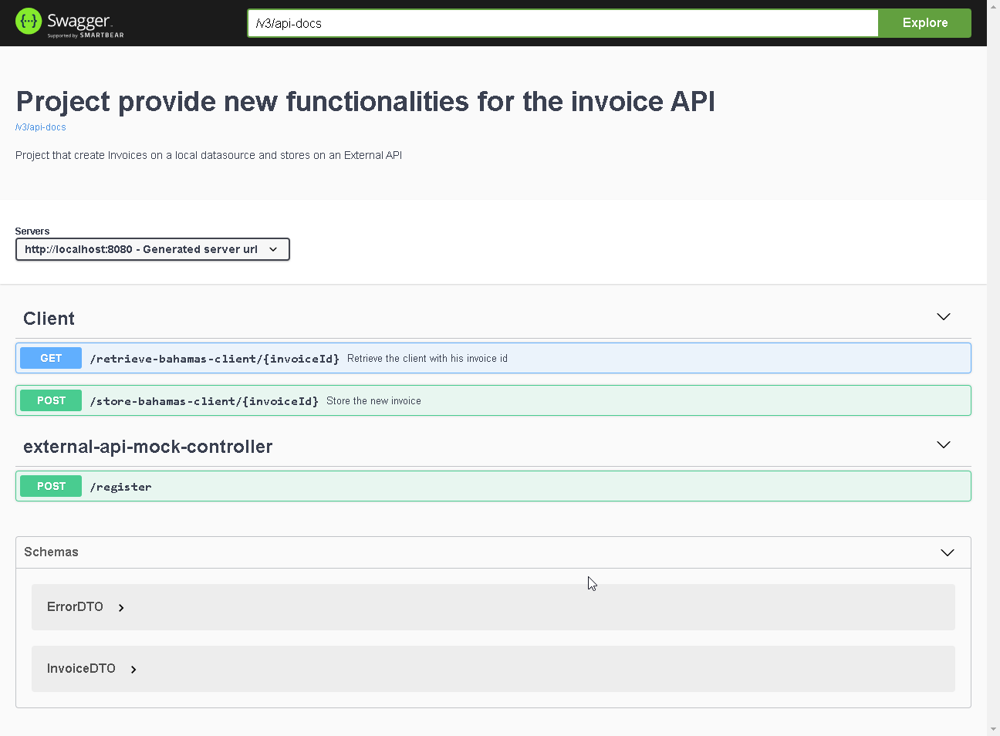

# Example with local invoices

This project was created to provide the storage of invoices on a local storage, integrating with external API on creation.

## Build
To execute this project run in the command line: 

``` mvn clean compile exec:java```

## External endpoint 

The external endpoint is deployed with the main application and can be overridden with the parameter `EXTERNAL_URL`

``` mvn clean compile exec:java -DEXTERNAL_URL=https://bahamas.gov/```

## The swagger of this api is accessible at

```http://localhost:8080/swagger-ui/index.html?configUrl=/v3/api-docs/swagger-config#/```




## Expected error

For testing purposes, this mock implementation is expected to generate an error when an invoice with id `555` is sent!